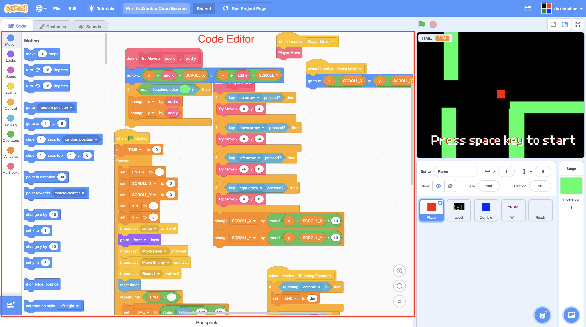

# Code Editor \(Code Area\)

Code Editor \(Code Area\) is where the blocks get assembled. 

* On the left, is the **Block Palette**. The blocks are organized into different categories and color-coded. 
* On the right, is the area you can drag and drop the blocks and assemble the blocks. 





