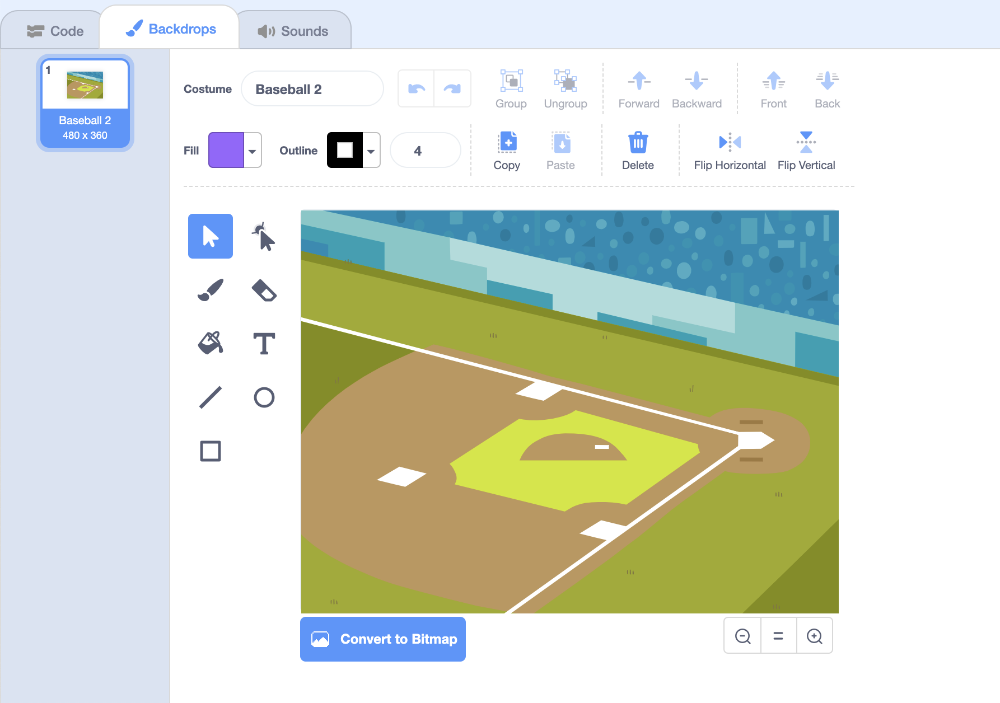
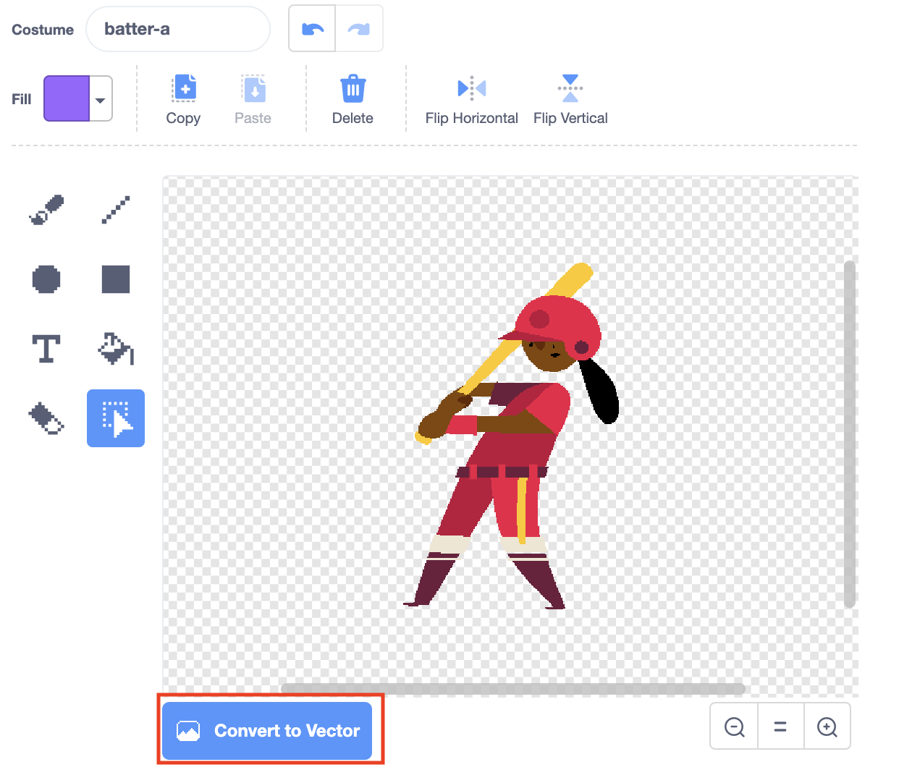
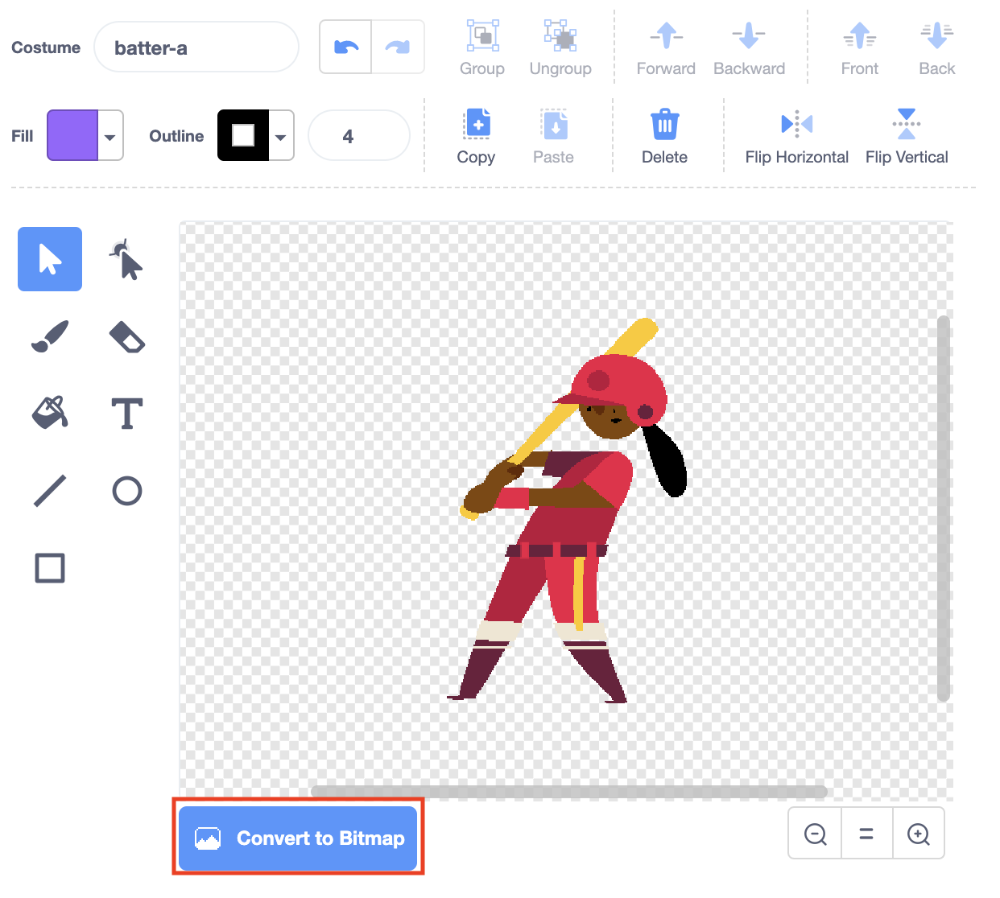

# Paint Editor

## Paint Editor

Scratch's built-in image editor. It can be used to edit the backdrops and costumes. 



## Bitmap vs. Vector

\(From ScratchWiki\)

At the bottom-left of the paint editor is the option to switch to the other \(bitmap or vector\) editor. When converting the images to the new editor, or new format, the program has to manipulate them.

#### Converting Bitmap to Vector

The option to convert to the vector editor.

When converting a bitmap image to the vector editor, the entire bitmap image becomes one united, single object in the vector editor. It contains its bitmap appearance, but the difference is when resizing the converted bitmap image. The vector editor resizes all objects differently than the bitmap editor, often more accurately to the original display. Any shapes converted from bitmap to vector do not transform into a vector shape or obtain splines; the program reads it as before.

#### Converting Vector to Bitmap

The option to convert to the bitmap editor.

When converting a vector image to bitmap, any objects that extend off the canvas will no longer be included; only a 480x360 resolution image can be created at maximum in the bitmap editor. Unlike from bitmap to vector, vector graphics lose the properties that are unique to them. Specifically, anti-aliasing is removed. Therefore, a smooth vector object may become very jagged and pixelated in appearance.

|  **Caution**: | After converting from vector to bitmap, converting back to vector will not retain the vector properties as the objects had before; however, undoing will bring back the properties. |
| :--- | :--- |

## Color Palette



