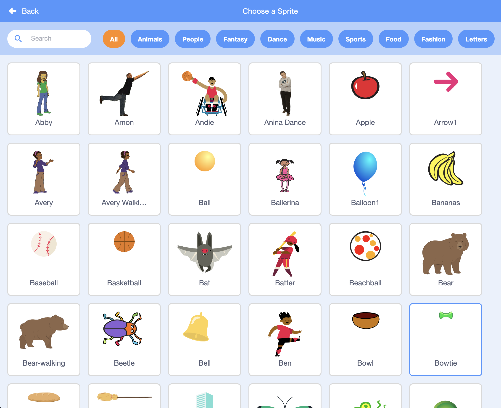
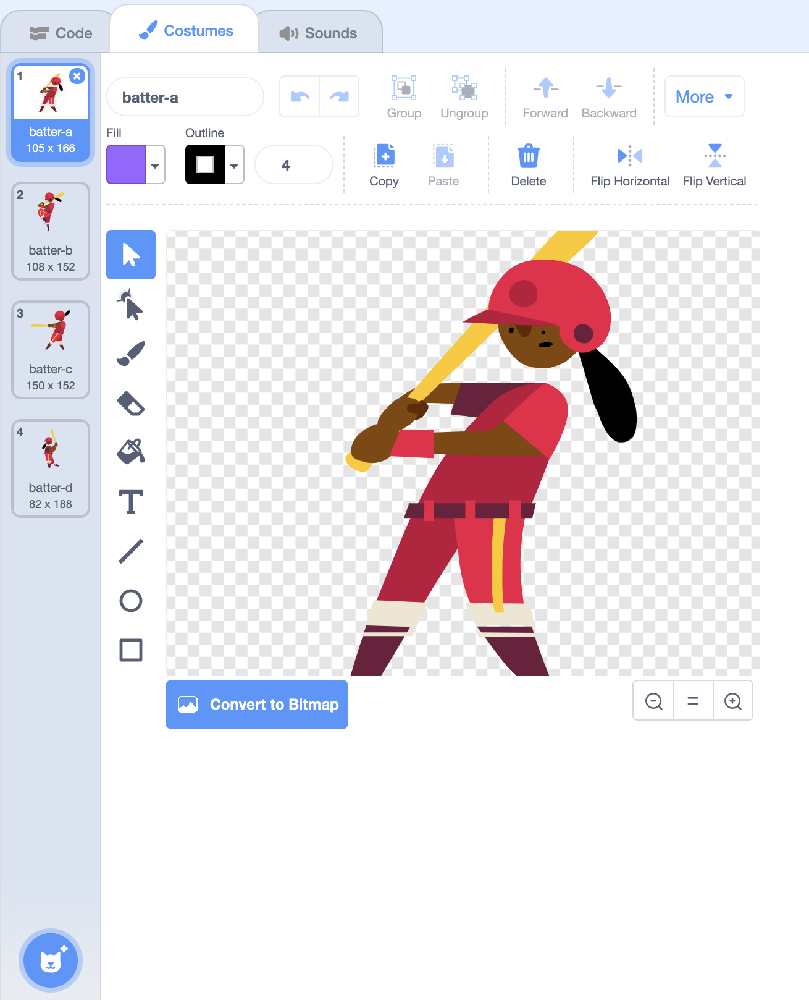
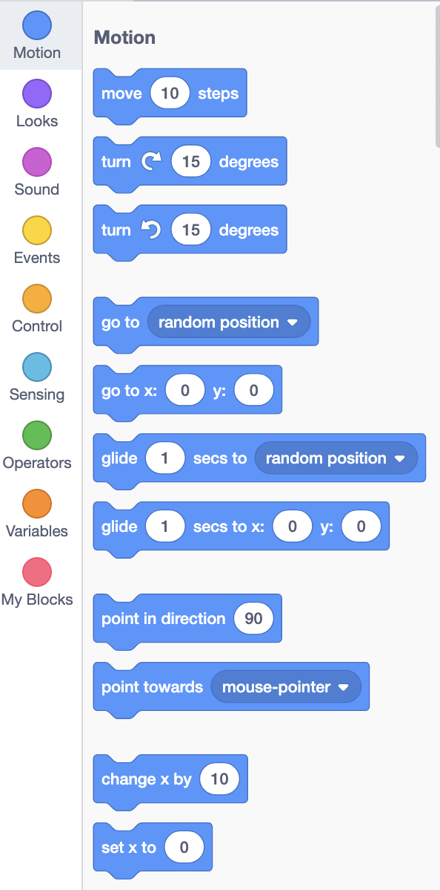
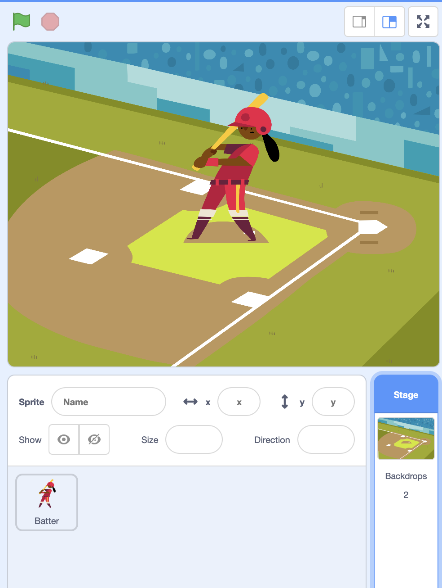
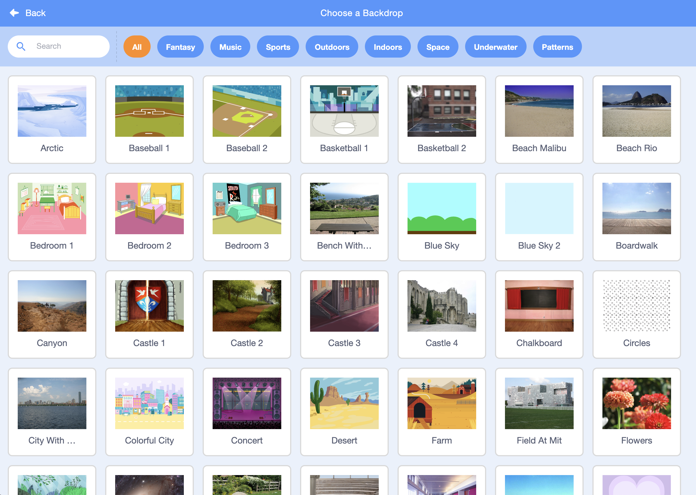
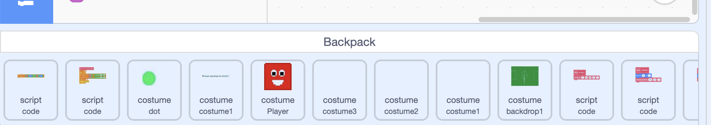
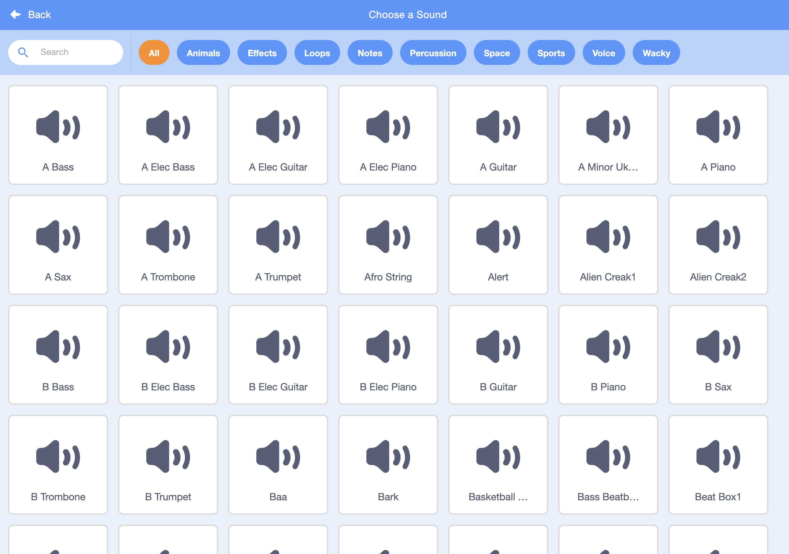

# Scratch Objects

## Sprites

Sprites are the objects that can perform actions. Sprites can be used as characters or objects in your project.  Sprite can have blocks\(code\), costumes and sounds. 

### More about Sprites





## Costumes

A **costume** is one out of possibly many "frames" or different looks/appearances of a [sprite](https://en.scratch-wiki.info/wiki/Sprite). 

### **More about Costumes**



## Blocks\(Code\)

Blocks are puzzle-piece shapes that are used to create code in Scratch. The blocks connect to each other vertically like a jigsaw puzzle, where each data type \(hat, stack, reporter, boolean, or cap\) has its own shape and a specially shaped slot for it to be inserted into, which prevents syntax errors. Series of connected blocks are called scripts.

There are ten categories of blocks: Motion, Looks, Sound, Lists, Events, Control, Sensing, Operators, Variables, and My Blocks. Only nine of these are shown in the Block Palette.

### More about Blocks



## Stage

The stage is the background of the project. A stage can have blocks\(code\), backdrops and sounds.

### **More about the Stage**



## Backdrops

A backdrop is one look of the stage. 

### **More about Backdrops**



## Backpack

A place where user can bring parts of code \(sprites, backdrops, costumes, sounds and scripts\) between projects. 

### More about the Backpack



## Sounds

Sounds are pieces of audio. 

