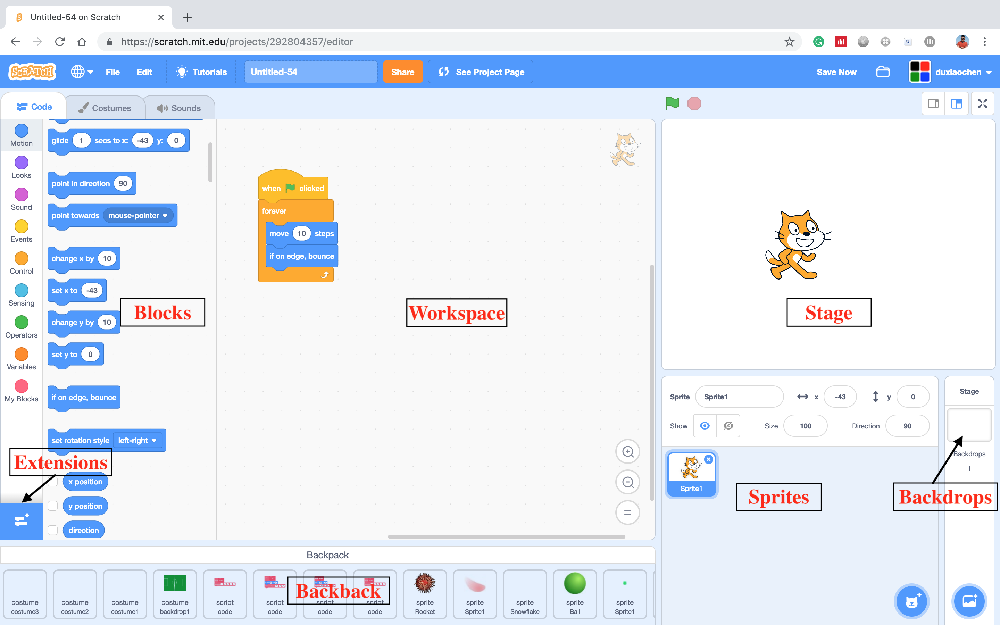

# Scratch Interface

## How to use the Scratch interface?

* **Blocks:**  Blocks are the building blocks. They are your code.  Blocks are organized into different categories with different colors. 
* **Workspace**: Workspace is the place to put your blocks. You snap the blocks together in workspace to build your project.
* **Stage:** You see the actual effect of your project in the stage area. You can see it in full screen.
* **Extensions**: Additional extensions  can be find from the extension section.
* **Sprites:**  Sprite is the your character, and objects that can move on the stage. 
* **Backdrops:** Backdrop is the background of the stage. 
* **Backpack:** Backpack is place you can store the artifacts that can be moved between projects. 

## Learn More about the Blocks



## 

