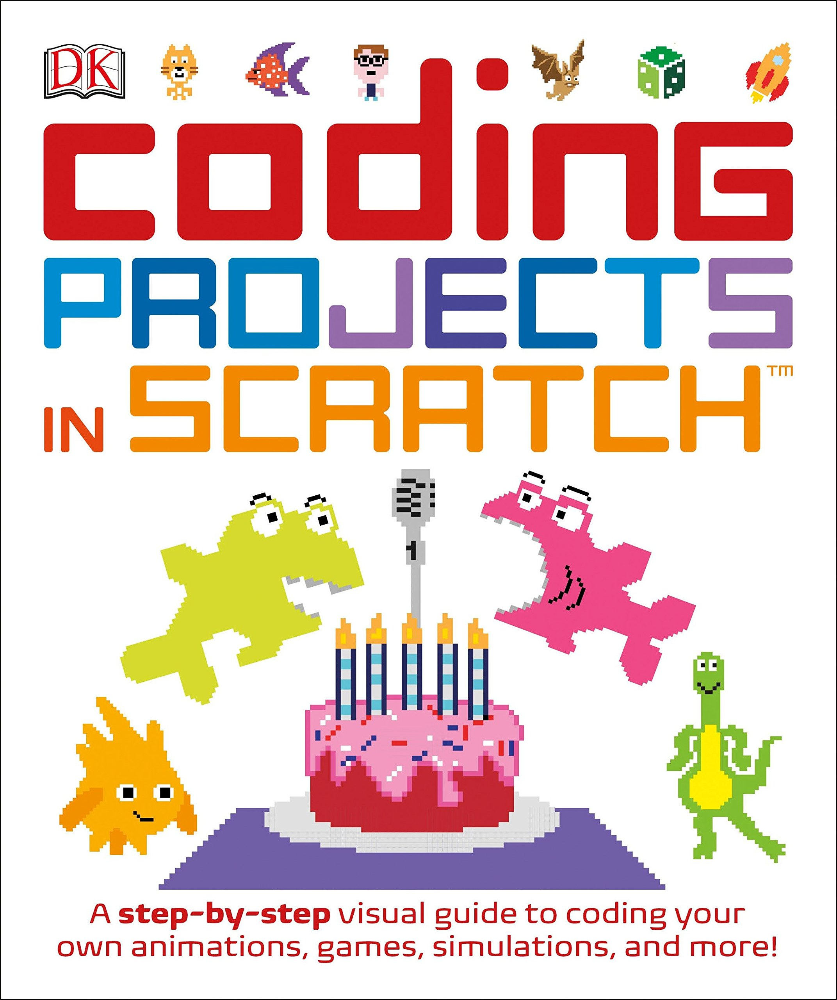

# Coding Projects in Scratch

{% embed url="https://www.amazon.com/Coding-Projects-Scratch-Step-Step/dp/1465451420/ref=sr\_1\_3?crid=P1V4URKLW5NM&keywords=coding+projects+in+scratch&qid=1556681381&s=gateway&sprefix=coding+pr%2Caps%2C120&sr=8-3" %}

4.7/5 Stars on Amazon.  

This is probably my favorite Scratch Book.  

## What I like most?

* The selection of the projects are excellent. Very fun and creative.
* Easy to follow instructions.


There is a Scratch 3.0 version coming in August 2019.  


