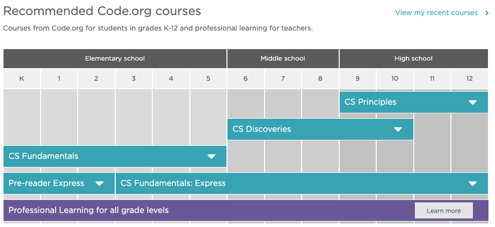
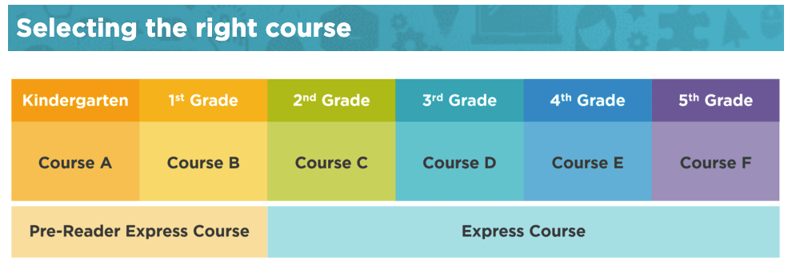

# Code.Org

Code.Org developed many CS courses using interactive web-based graph block-based interface. Computer Science Fundamentals courses are flexibly designed for teachers new to CS who want to offer accessible and equitable introductory CS courses to their students. 



