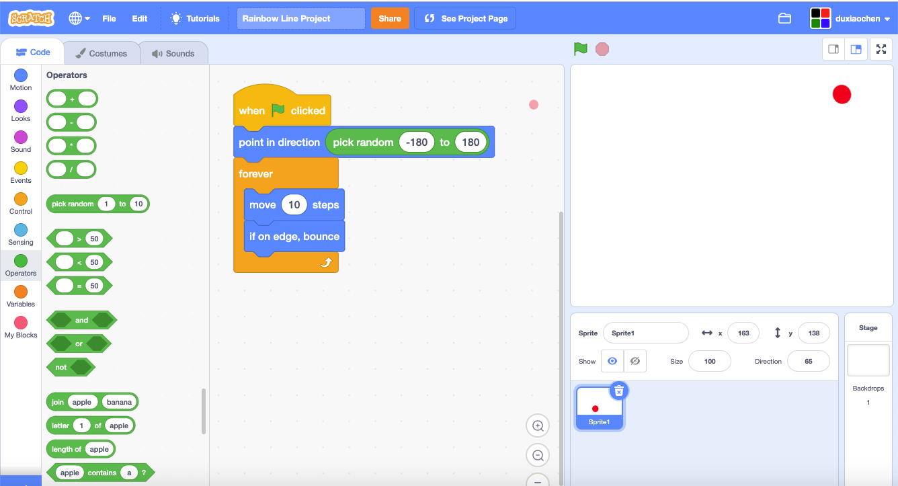
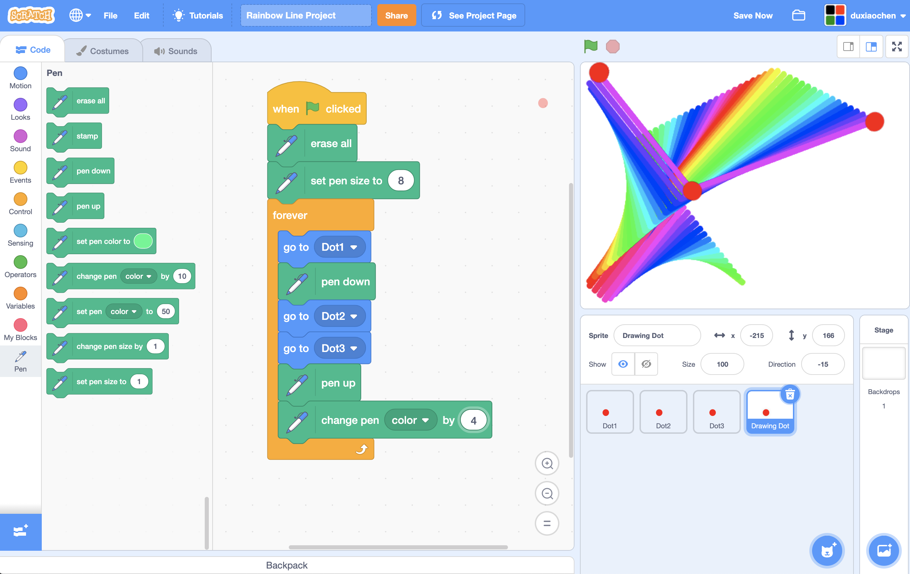
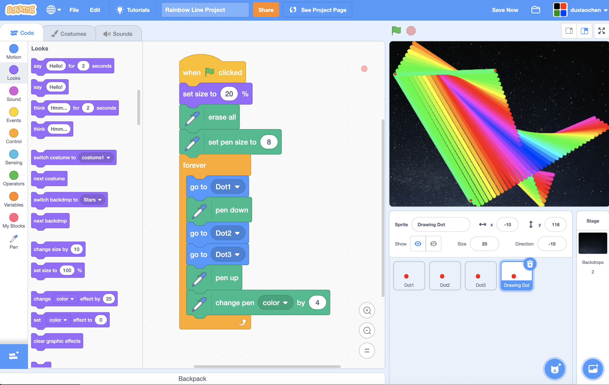
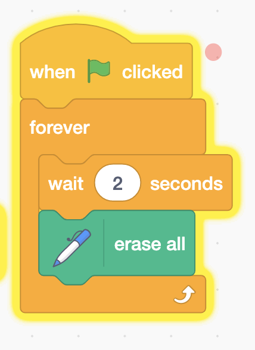

# Rainbow Lines in Space



## Step 1:  Create a bouncing dot

## Step 2: Create rainbow lines

1. Duplicate the Dots 3 times. 
2. Use one dots for drawing.
3. Adding drawing code.

## Step 3:  Add Backdrop

## Step 4: Clear the screen every two seconds

## Step 5:  Try other things

* Turbo Mode
* More dots
* Fix some dots' position
* Not random

