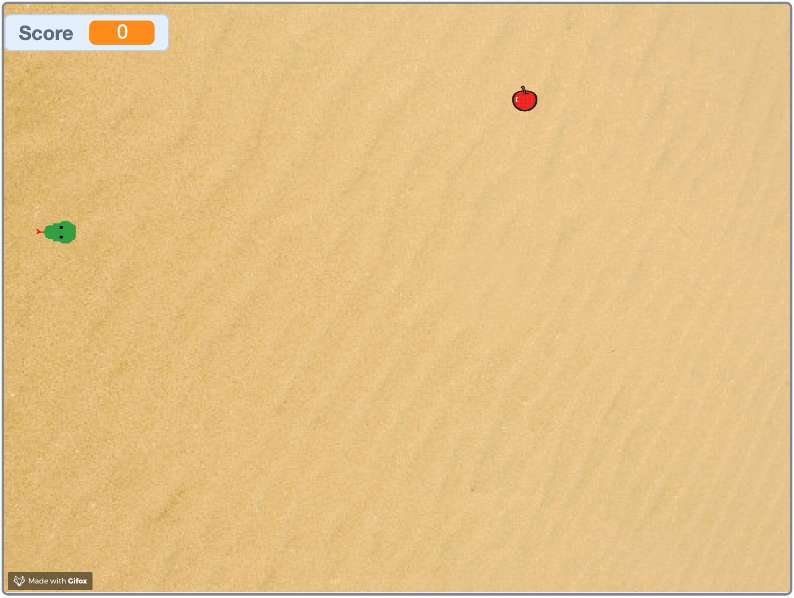
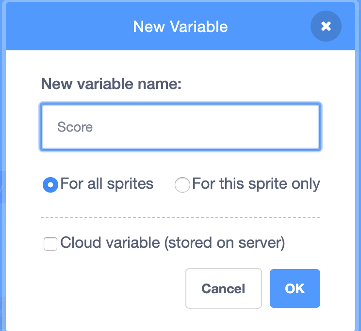
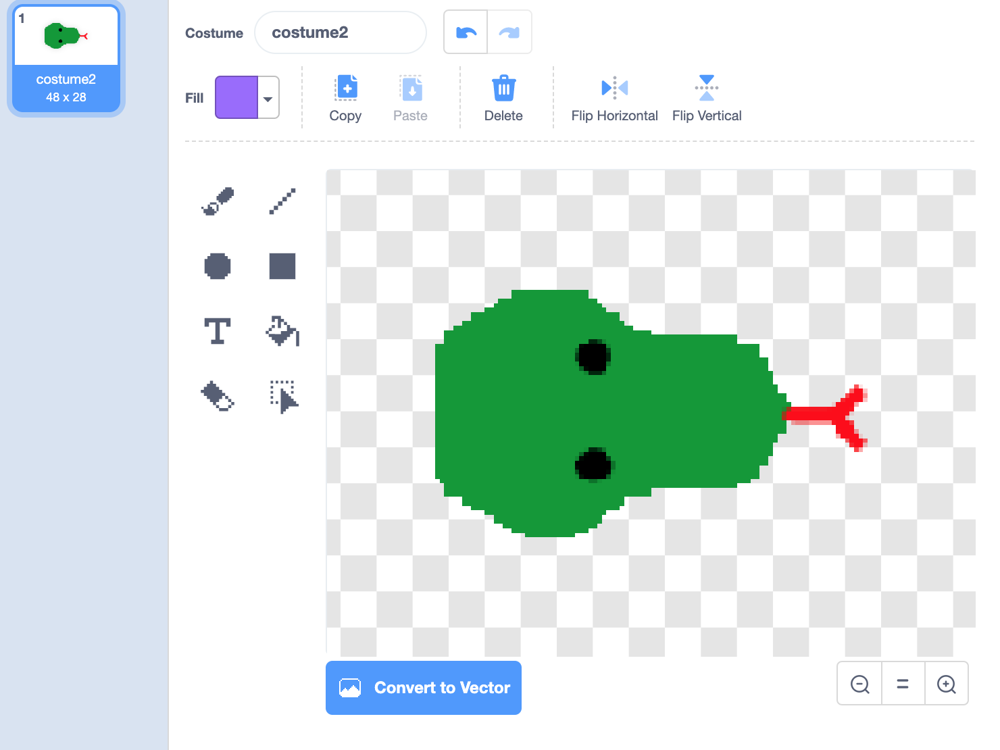
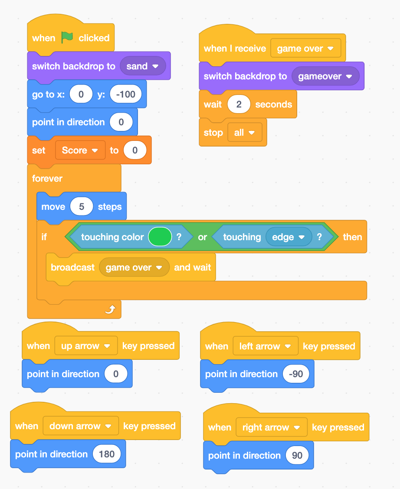
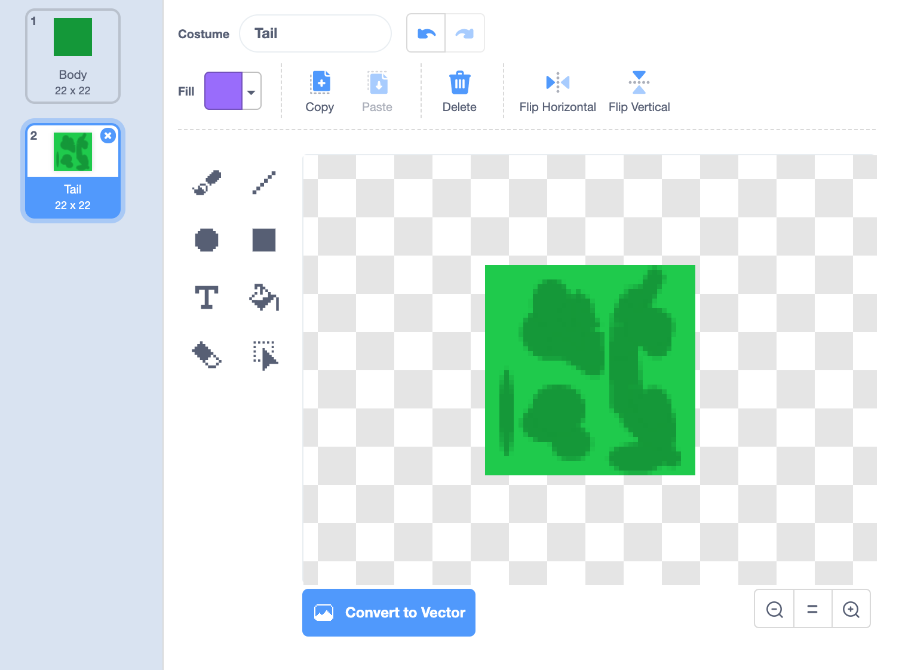
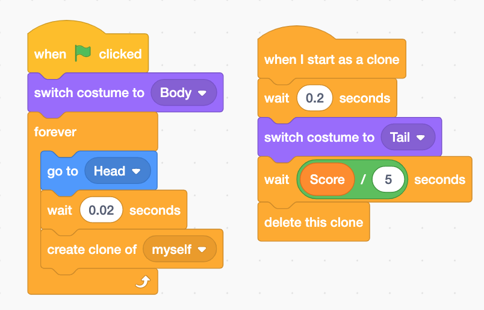
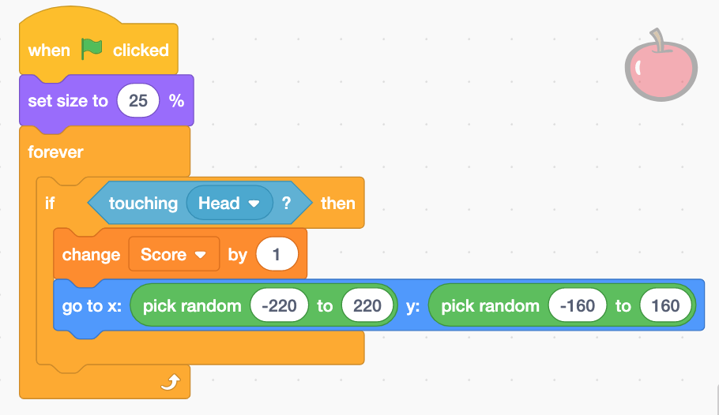
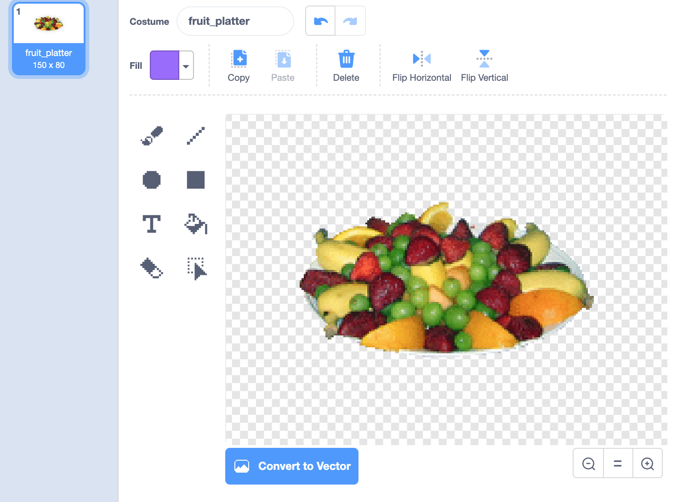
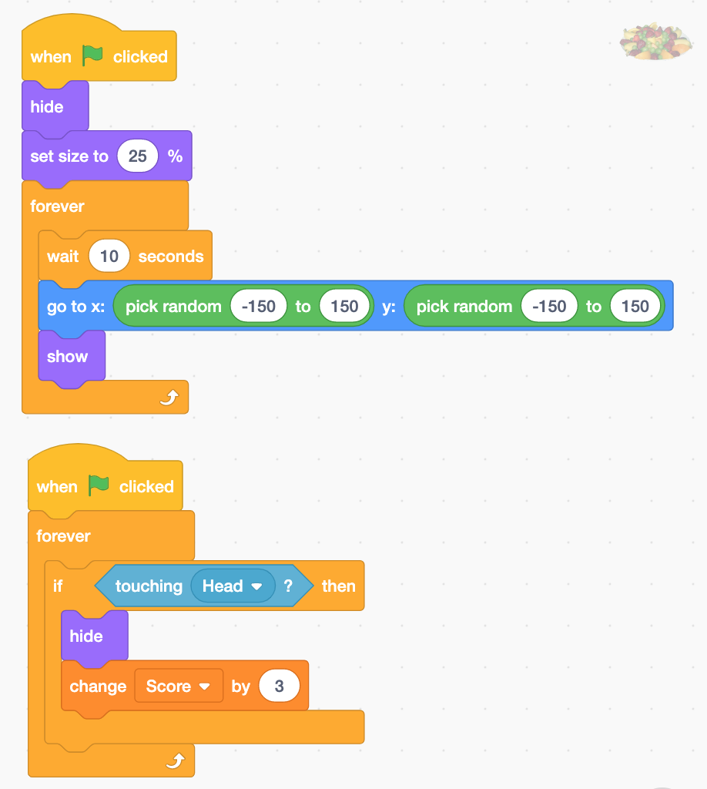

# Snake

This game looks like this. 

## Tasks

1. Snake head that can be controlled by arrow keys
2. Snake body. The length of the body is proportional to the score.
3. Score tracking. Score increases when touch an apple. 
4. Game over when the snake head touches the wall or the body.

## Score

## Snake Head

Design the snake head

The code for the head.

When to end the game?

* When the snake head touches the tail or the walls.

## Snake Body and Tail

The design:

The code: 

## Apple

Add an "Apple" sprite.

## Fruite Plate

## Add a Backdrop

