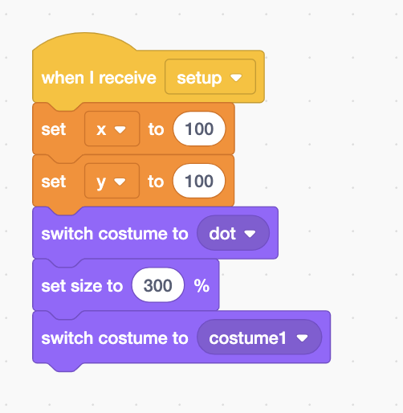
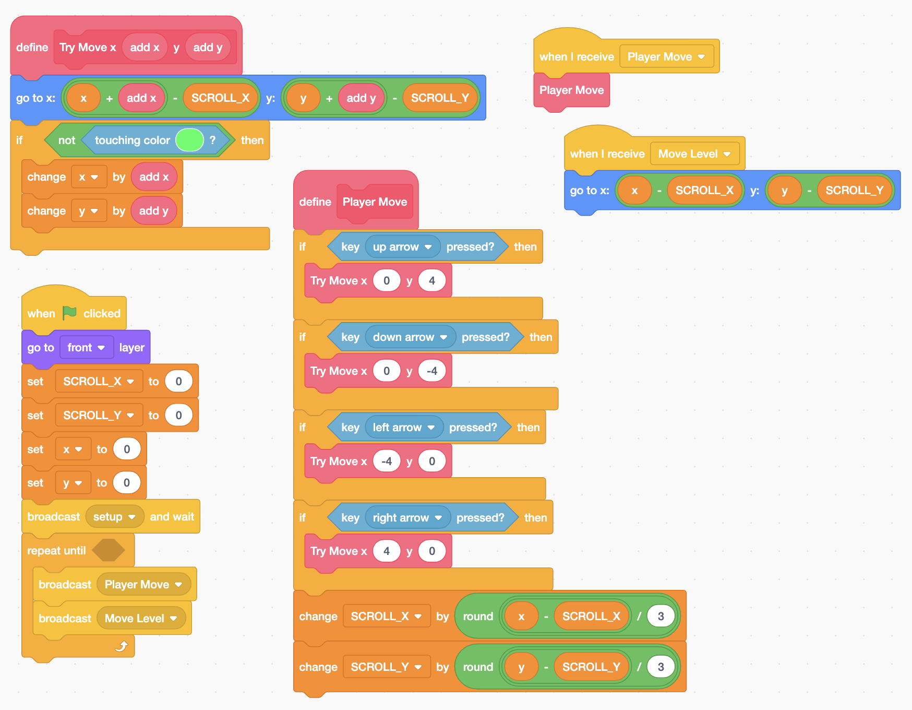
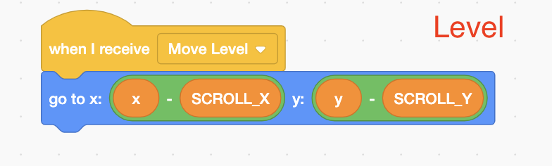
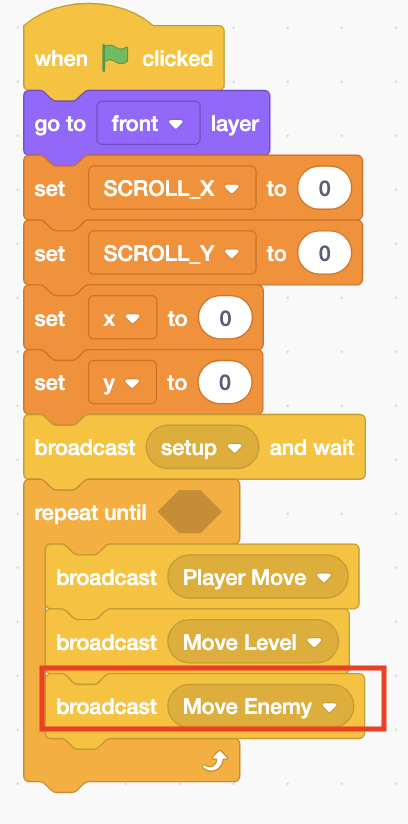
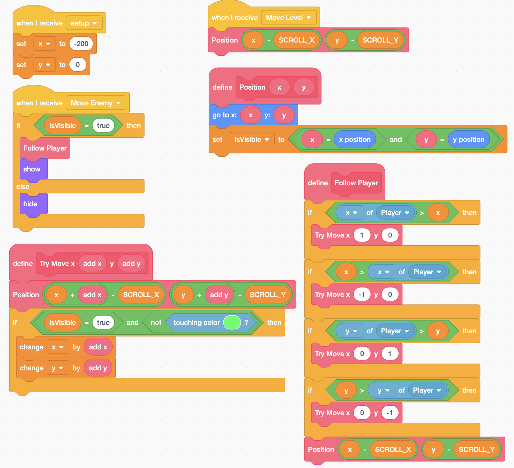
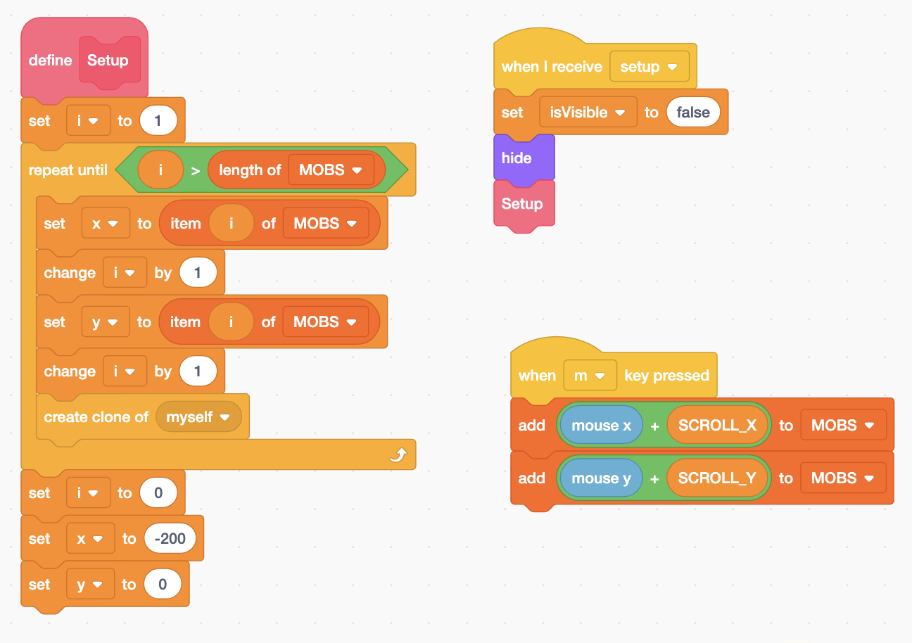
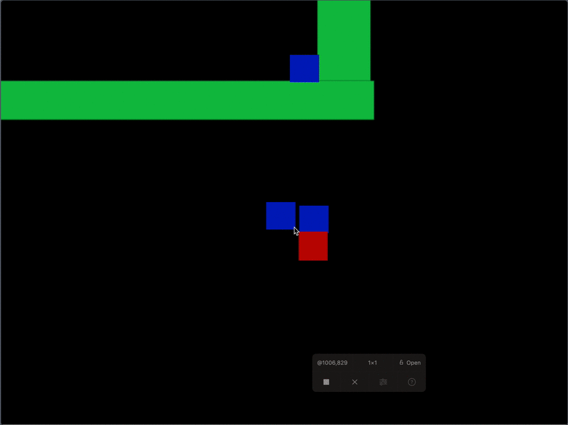
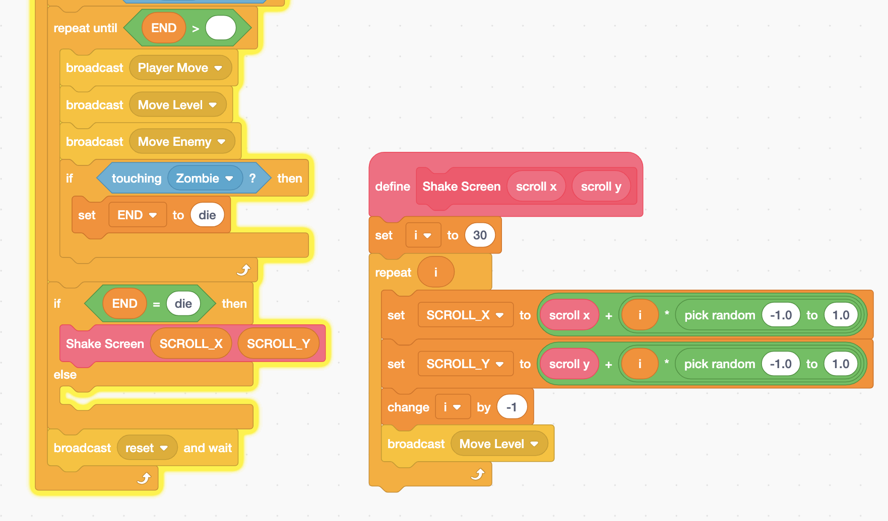

# Zombie Cube Escape by Griffpatch

## What is this?

This is the [game](https://scratch.mit.edu/projects/284516654/) and [video tutorial](https://www.youtube.com/watch?v=GXsjYupfDYk&t=159s) created by [griffpatch](https://scratch.mit.edu/users/griffpatch/).  



## Part 1 

In Part 1,  we will create a player and a ground for the game.  

* The player is a sprite that you can control with keyboard. 
* The ground \(Level sprite\) is the game's playground. One ground is one level. 



You can see my completed part 1 project at: 



### How to create a ground that is bigger than the scratch screen?

Create two costumes, one is small, the other is the real ground.  Switch to the small costume first, then change the size, then switch to the ground. 

### Variables

* For Player only:  x and  y.
* For Level only: x and y.
* For all sprite: SCROLL\_X, and SCROLL\_Y.

### How to scroll the ground to the opposite direction, while keeping the player at the center of the screen?

In the run-loop:

1. Detect the key event to move the player.  \(See **Player Move** block and **Try Move** block.\).
2. Prepare the **Level** sprite to move to the opposite direction by changing **SCROLL\_X** and **SCROLL\_Y**.
3. Tell the **Level** and **Player** to move by sending the **Move Level** message. 

## Part 2

In Part 2,  we will create a zombie that follows the player. 

### Add a message to move zombie

### The code for zombie

## Part 3

Create multiple zombies and use a list to keep track of the zombie's position. 

New Variable: 

* MOBS:  a list to hold the positions of the zombies.

### How to create zombies 

## Part 4

Add game over animation. 

## Part 5

