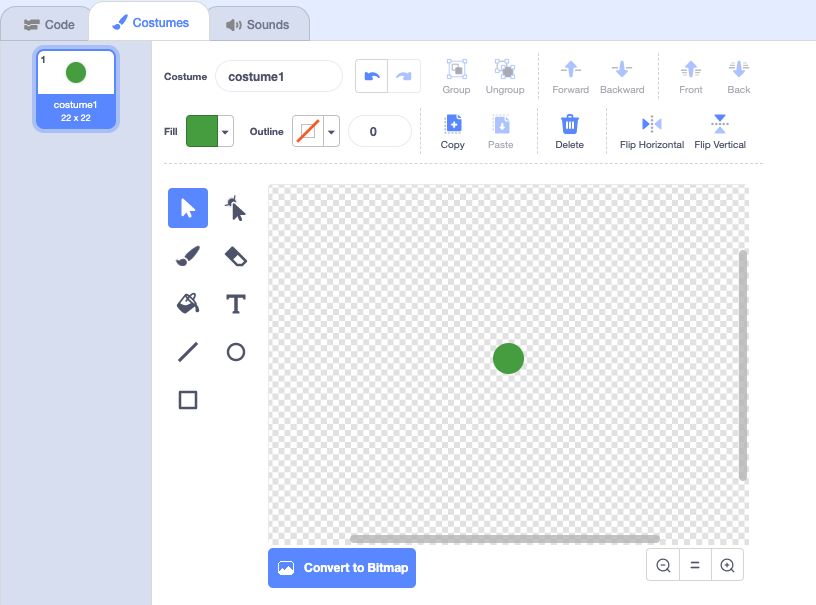
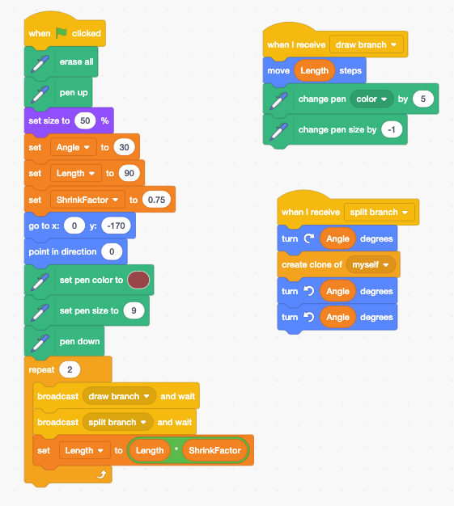

# Fractals

## What is Fractals?

Basically fractal is the never ending pattern. 



## Fractals in Nature



## Fractal Tree

### Create a sprite called Leaf

Create Fractal Tree

* Draw Branch
* Split the branch
* repeat

### Tree More

* Change the angle
* Create a different leaf
* Create more branches
* Make a broccoli 
* Make your own Fractal Tree

Can you find more things in nature are fractals?

## Learn More



{% embed url="https://en.scratch-wiki.info/wiki/Recursion\_and\_Fractals\#targetText=Recursion%20can%20be%20implemented%20in,amount%20of%20copies%20of%20itself." %}

