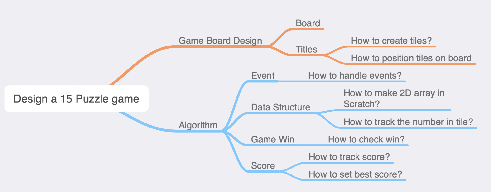
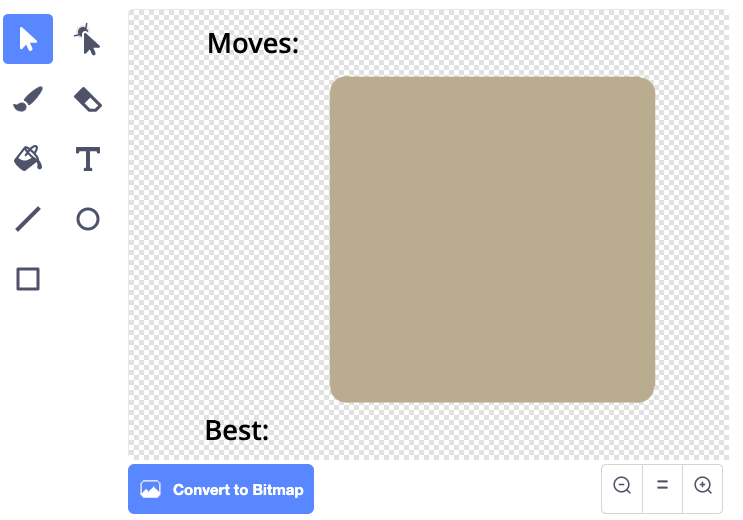
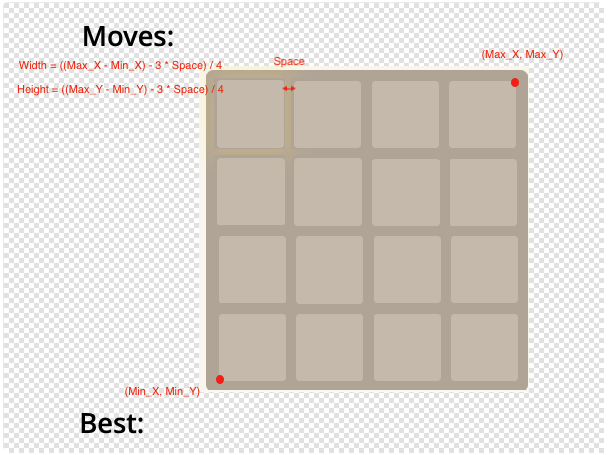
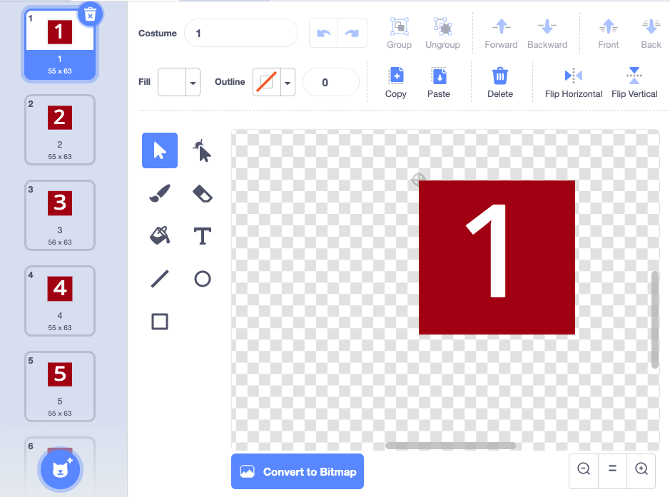
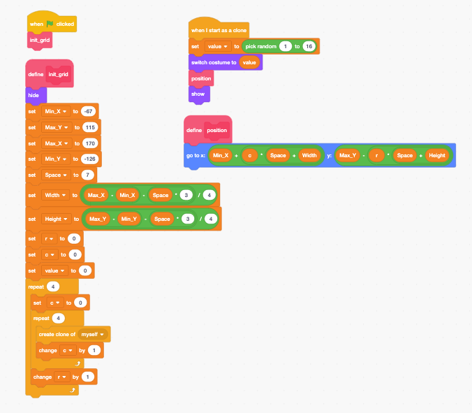
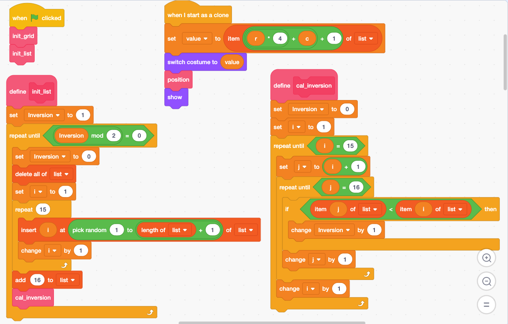
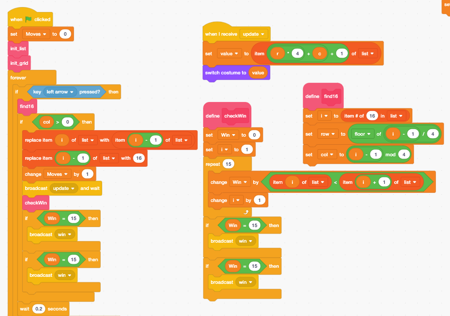
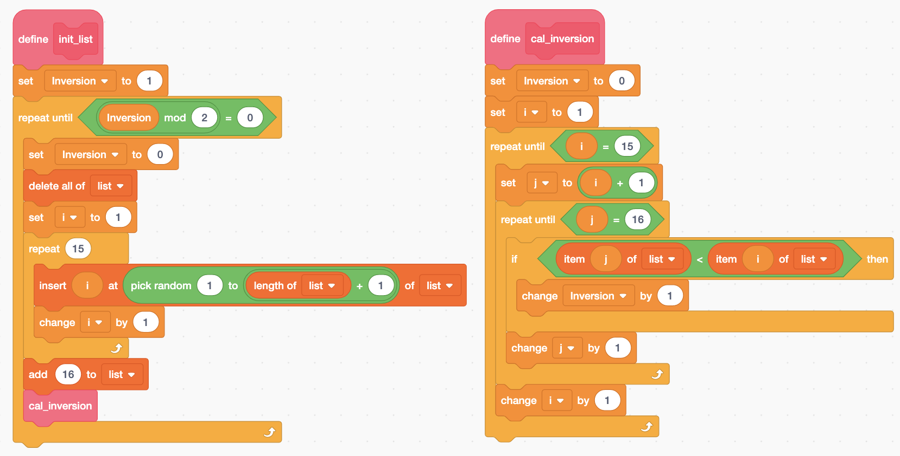
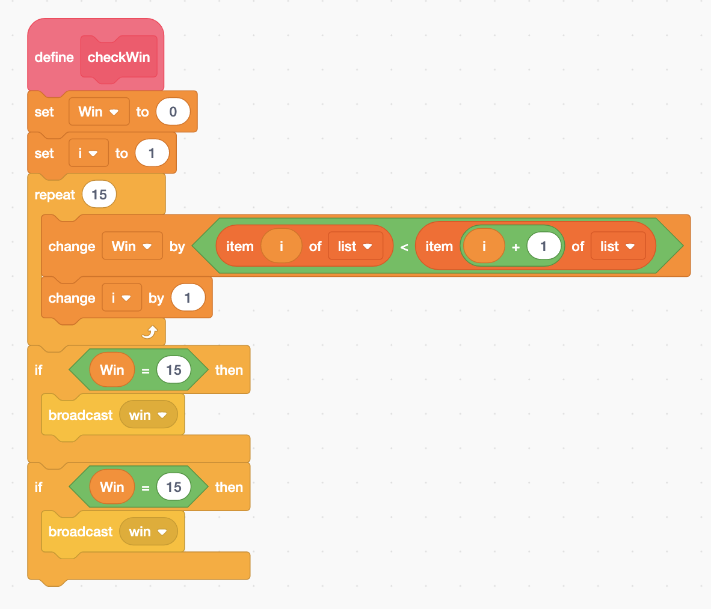
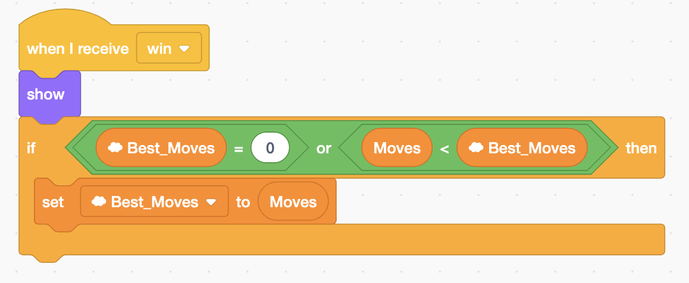

# 15-Puzzle

The 15-puzzle \(also called Gem Puzzle, Boss Puzzle, Game of Fifteen, Mystic Square and many others\) is a sliding puzzle that consists of a frame of numbered square tiles in random order with one tile missing.



## Finished Game



If you want to know how to solve this puzzle, you can check this instruction: 



## Game Design

When we design the game we need to think about the following questions?

## Game Board Design

Draw a backdrop that looks like the one in the image. 

If you don't know how to draw rounded corner, check this [youtube video](https://www.youtube.com/watch?v=vywd08v8KD0). 

## The size of the tile

We are going to use the method illustrated in the image to calculate the tile size. 

Use this trick to figure out the Max\_Y, Max\_Y, Min\_X and Min\_Y. 

## Create tiles 1 to 15, and a blank tile

## Data Structure - List 

We are going to create list with number 1 to 15 at the random position, and have the value 16 at position 16. 

Not all random combinations are solvable. Actually half of them are not solvable.  The function cal\_inversion is used to check if the game is solvable. If the Inversion is an even number it is solvable. 

You can learn more about the algorithm here:



#### The relationship of \(row, column\) and index. 

## Local variables for Tile

* r:  row 
* c: column
* value: the number in the tile.  The value is also the index of the costume. 

## Moving the tile

1. Find the empty title. 
2. Swap  the tile next to the empty tile, depends on the arrow key.
3. Check if the list is sorted. 

## Check if the puzzle is solvable

Half of the random generated puzzles are not solvable. You can check if the puzzle is solvable using inversion counting method. 



## Check Win

If the list is sorted from small number to large number, the puzzle is solved. 

## Track the best score

## 

