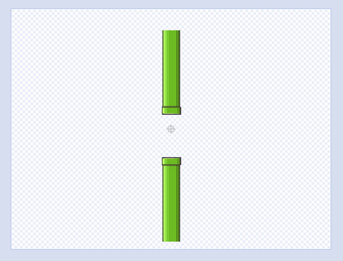
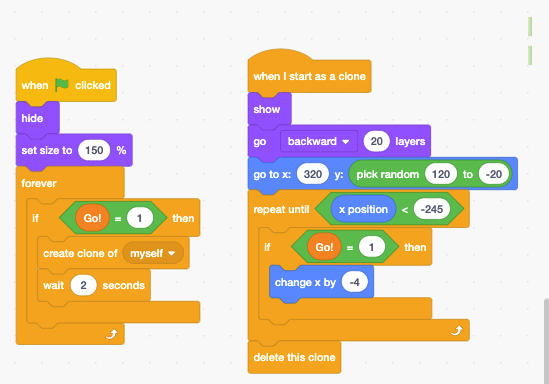
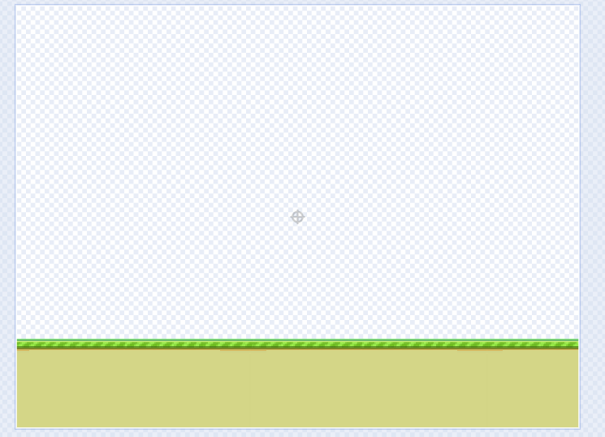
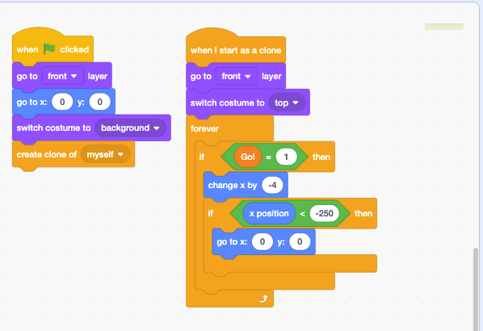
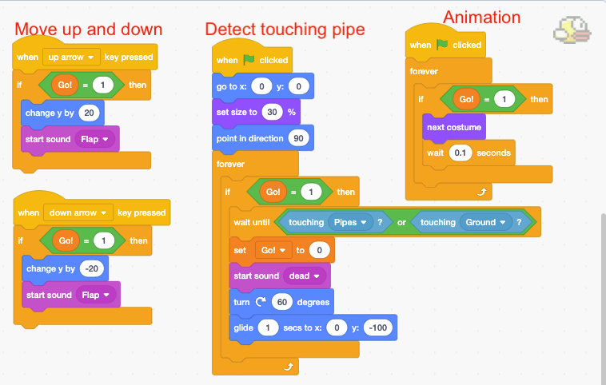

# Flappy Bird



## Key Ideas

The bird only moves up and down. The pipes and ground are moving, which creates the illusion that the bird is moving. This is a common technic in games.

## Sprites

* The bird
* Pipes
* Ground

## How to make moving pipes

## How to make moving ground

## The bird

* Use key listener to move up and down
* Detect touch pipe
* Animation for flapping wings

## Extensions ideas

Try your ideas:

* Adding gravity
* Changing the character 
* Adding props into the game, such as coins
* Control the speed and frequency of the moving pipes

