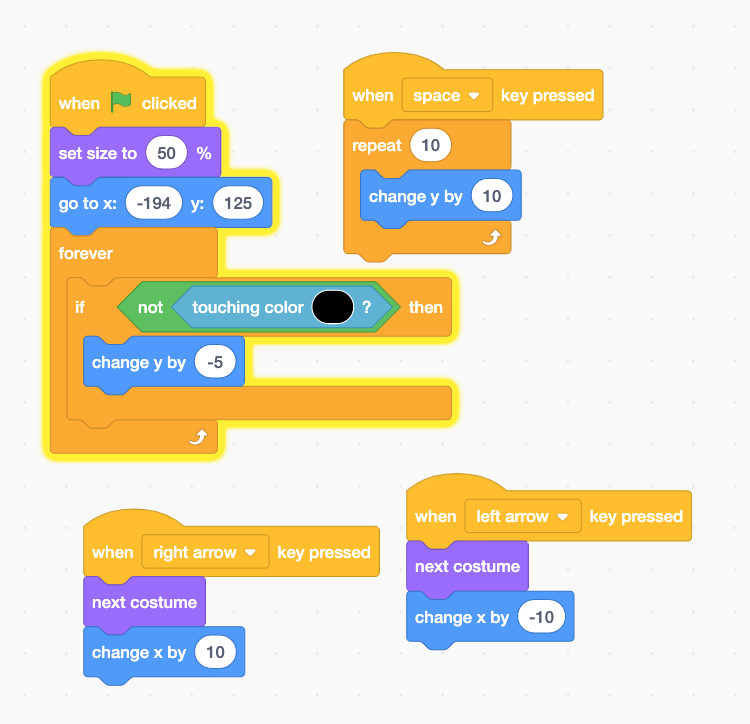

# A 2D Platform Game

## What is Platform Game?



According to Wikipedia: 

"**Platform games**, or **platformers**, are a video game genre and subgenre of action game. In a platformer the player controlled character must jump and climb between suspended platforms while avoiding obstacles."

## Examples

### Super Mario Brothers



### Snail Platformer 



### Flappy Birdy



## Making a Platform Game

### Gravity, Jump, and Platform

