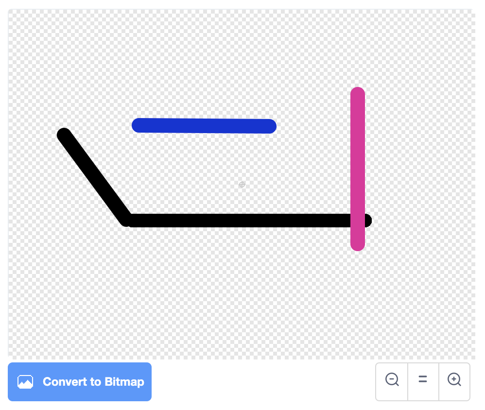
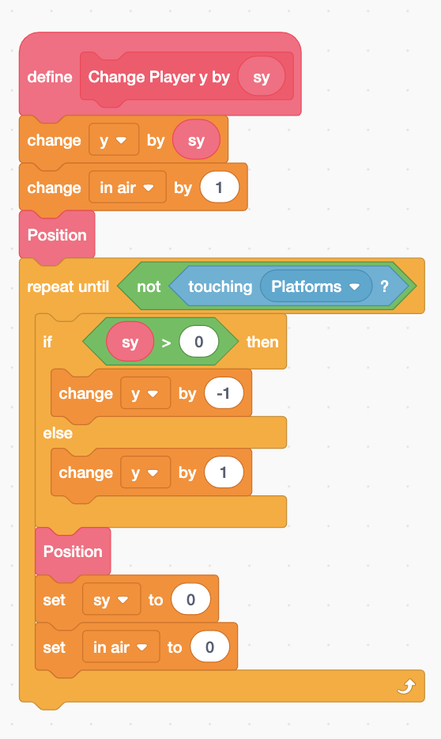
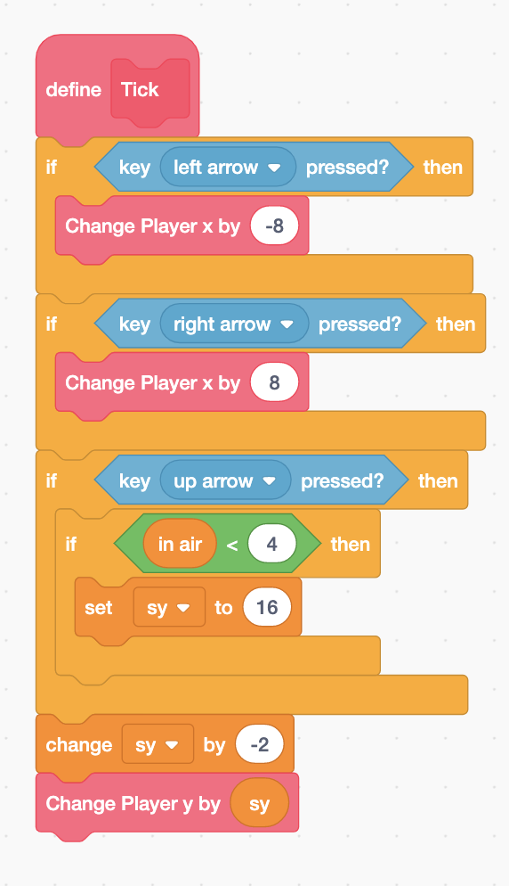
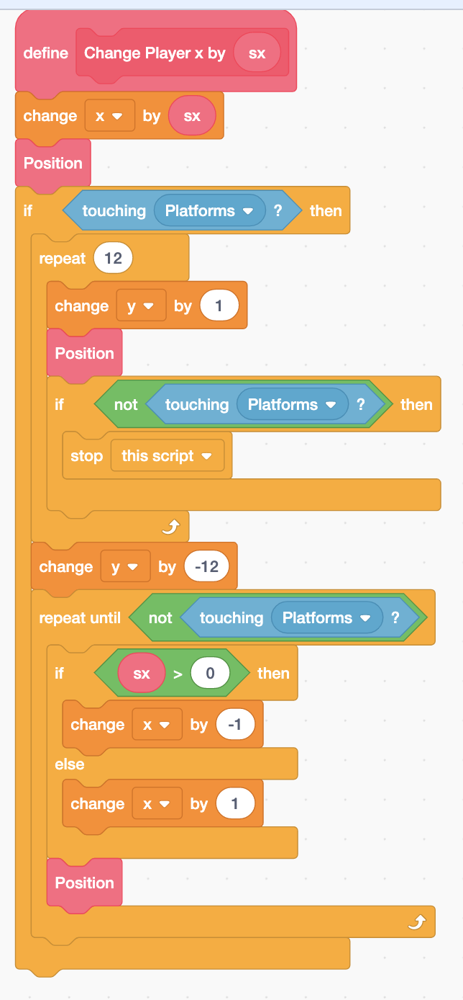
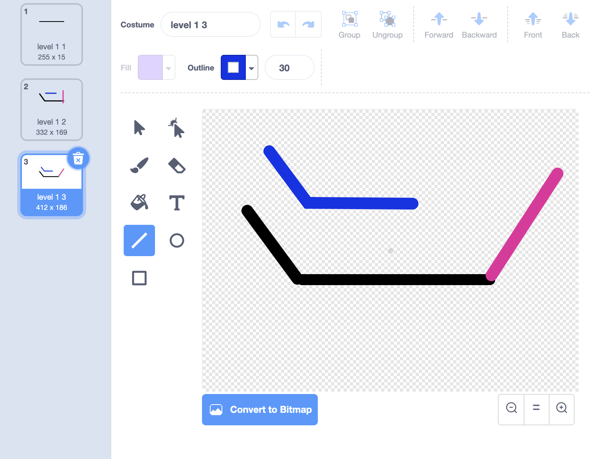
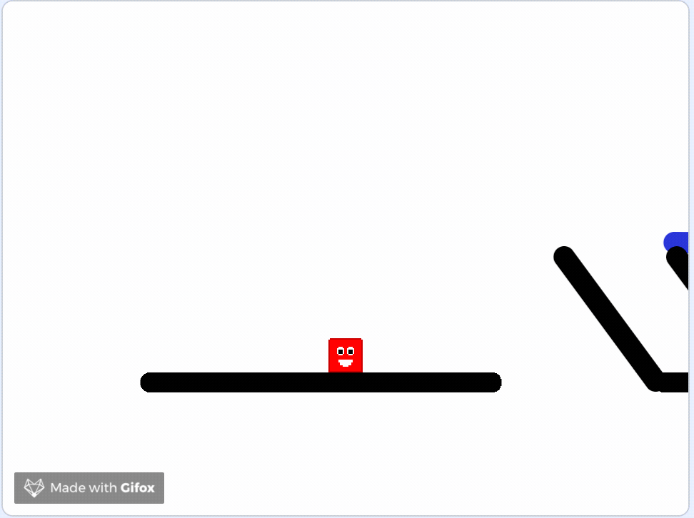

# Scrolling Platform Part 3: Platform Detection



## Costume:  Leve 1 2

## Preventing from jumping through the platform

In the "Change Player y by sy" block, if the player is touching the platform, we were always change the y by 1.  We need to change the y value based on the direction of the movement. 

## Preventing moving through block on the X direction

To preventing moving through block, we will do the similar code as **Change Player y by sy,** for x. 

## \(Optional\) Climbing slope

The following changes can allow climbing slope that is &lt; 45 degree.

## Adding Another Level

## Understand Clone





