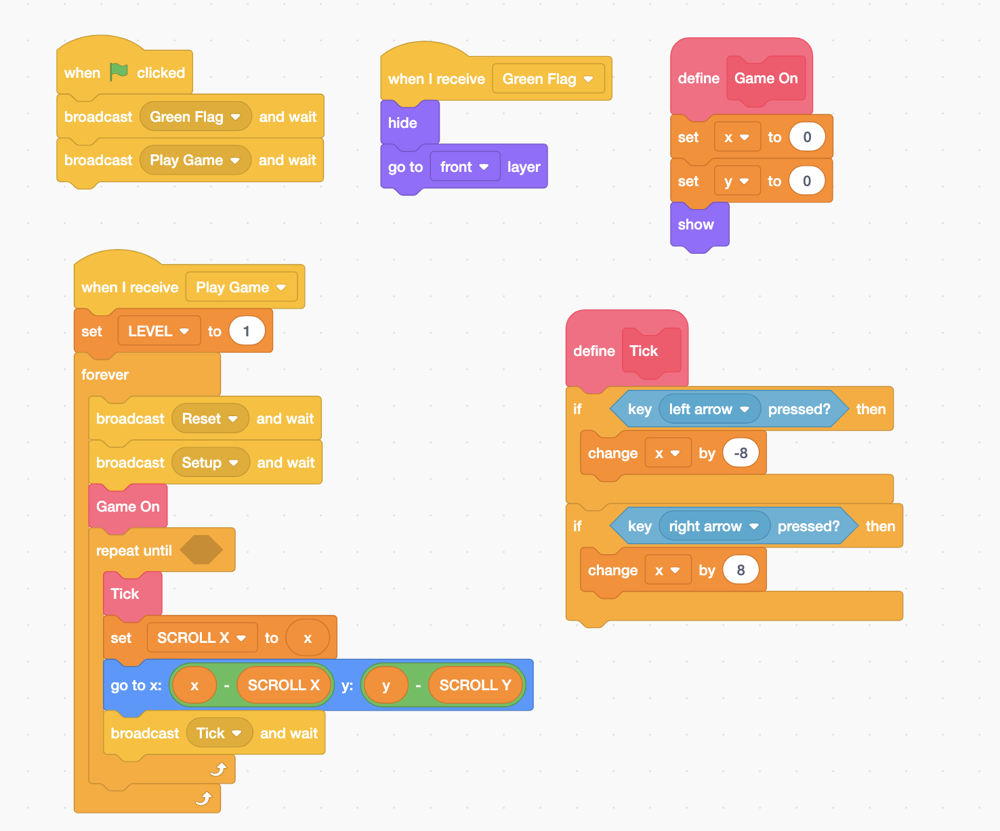
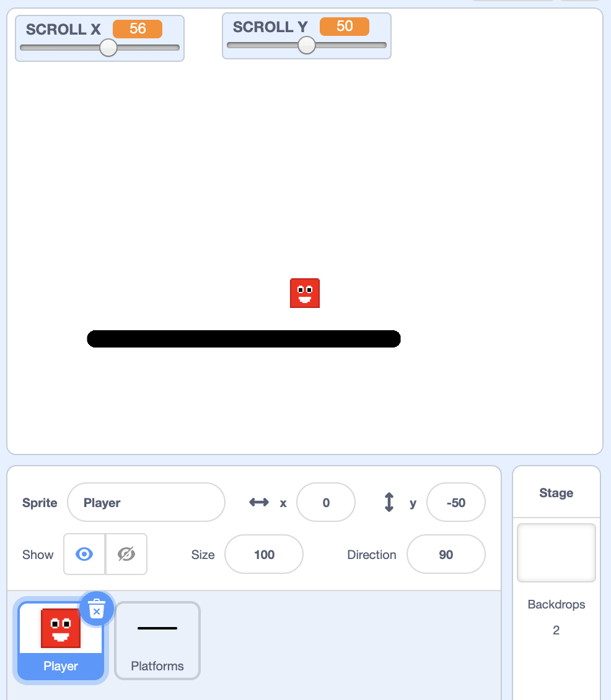
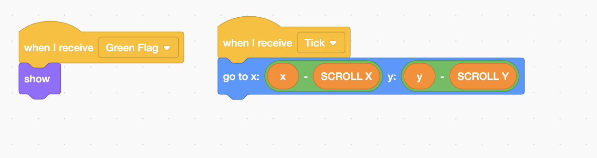

# Scrolling Platformer Part 1



## Setting Up

1. Remix: griffpatch's assets for Scrolling Platformer project. [https://scratch.mit.edu/projects/270939991](https://scratch.mit.edu/projects/270939991)
2. Rename the **Assets** Sprite to **Player.**  Delete **Splash** sprite. 
3. Variables for Player sprite. 
   1. LEVEL   : \(Global\)
   2. SCROLL X: \(Global\)
   3. SCROLL Y: \(Global\)
   4. x: \(local\)
   5. y: \(local\)
4. Variables for Platforms:
   1. x: \(local\)
   2. y: \(local\)

## Player Sprite

## Platforms



## 

