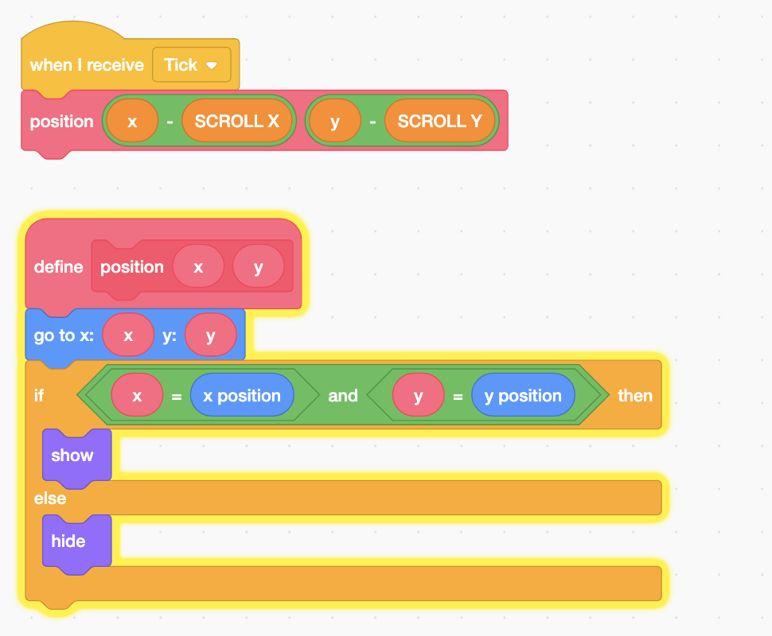
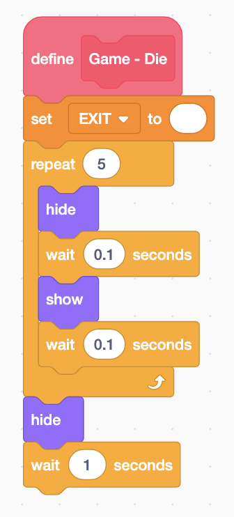
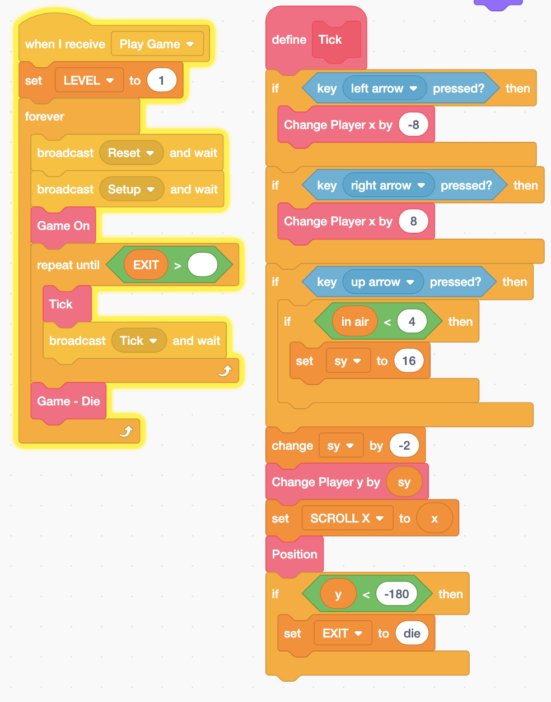

# Scrolling Platformer Part 4:Offscreen Sprite and Player Death



* Fixing offscreen Sprite bug
* Die animation
* Lava detection

## 

## Fixing offscreen Sprite bug

Add a block on **Platform** Sprite. 

## Game Over Animation



