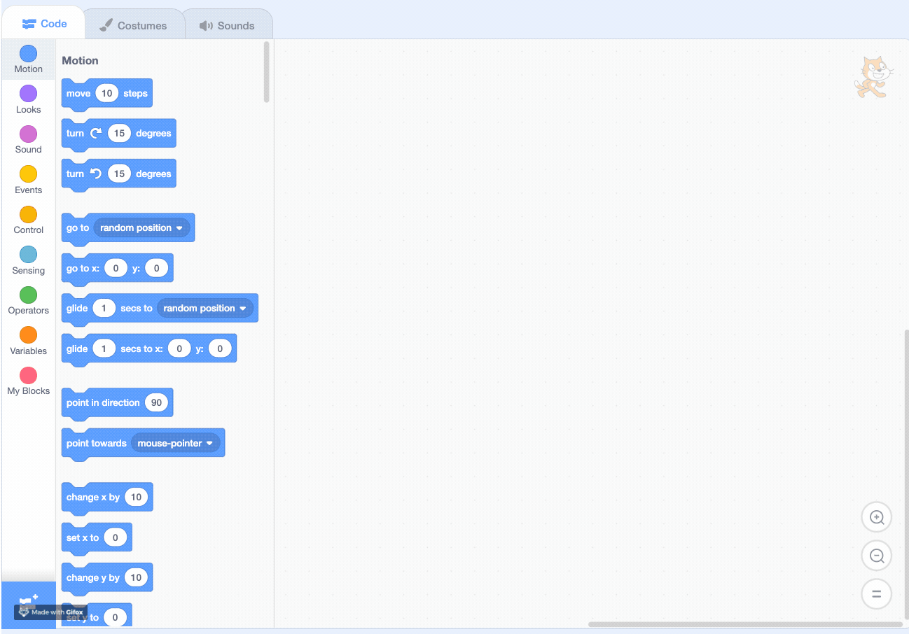
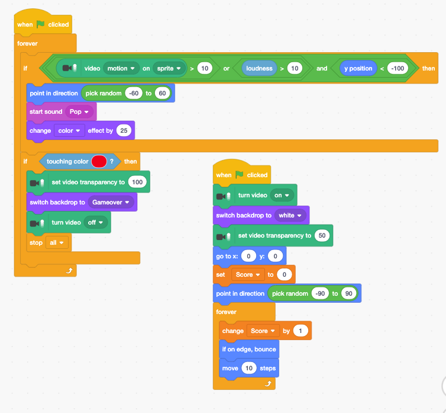

# Video Sensing Pong Game

## What is Sensor

A **sensor** is a device, module, machine, or subsystem whose purpose is to detect events or changes in its environment and send the information to other electronics  -- [Wikipedia](https://en.wikipedia.org/wiki/Sensor)

There are a lot of sensors in your house.  

* Smoke detectors
* Video doorbell \(Ring\)
* Smart thermostat \(Nest\)
* Alexa
* Wii 
* Apple TV Remote
* iPhone

In iPhone along, there are many sensors, such as light sensor, accelerometer, compass,  NFC, Face ID, etc. 

## Video Sensing in Scratch

## Video Sensing Pong Game



Add the Ball Sprite and add the following blocks.

