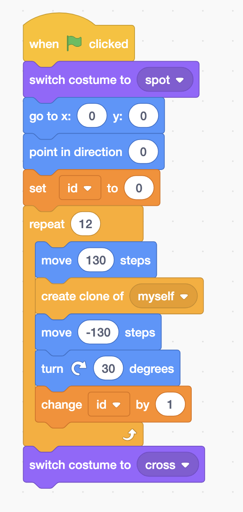
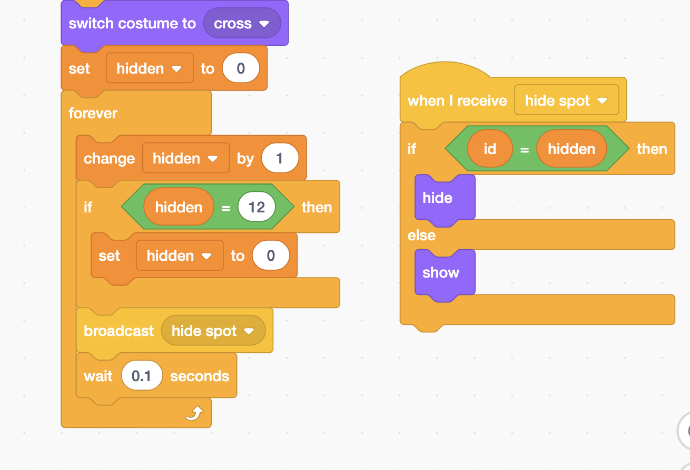
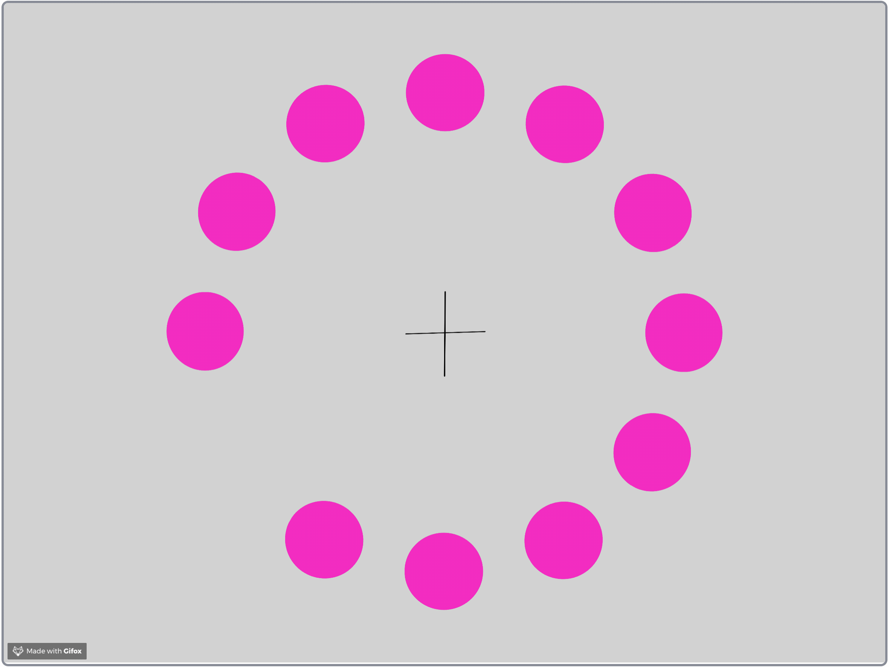
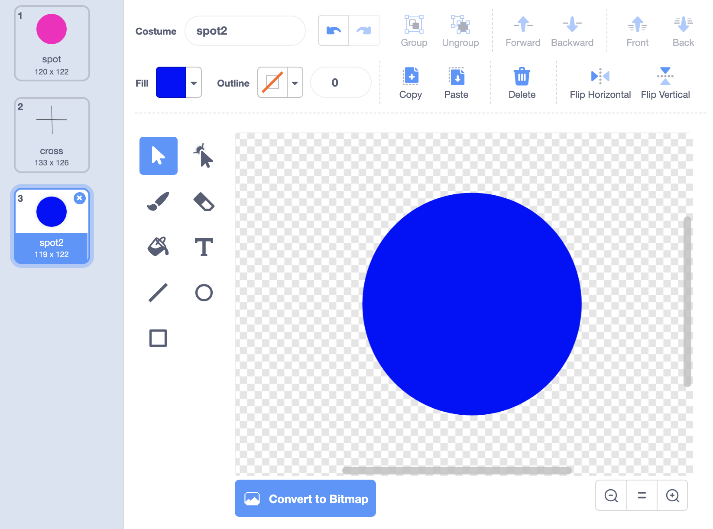

# The Magic Spot

This project shows you an amazing optical illusion.  This project is from the book "[Coding Projects in Scratch](../../scratch-book-reviews/coding-projects-in-scratch.md)" by Jon Woodcock. 

## Create a Spot

Create the a sprite with two costumes. One costume is a pink spot, the other costume is a cross. 

## Create 12 Dots

Setting up the stage with 12 Dots.

## Create a optical illusion

**Stare at the cross in the middle. Did you see a green dot that is moving around?**

## What's going on?

Your braining is filling the missing spot with the opposite color of pink. 

## Try a different color



## More Color Illusion games







