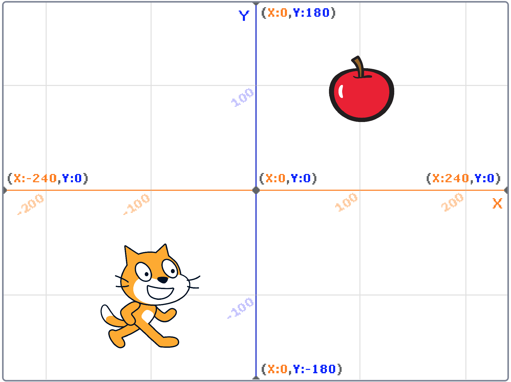
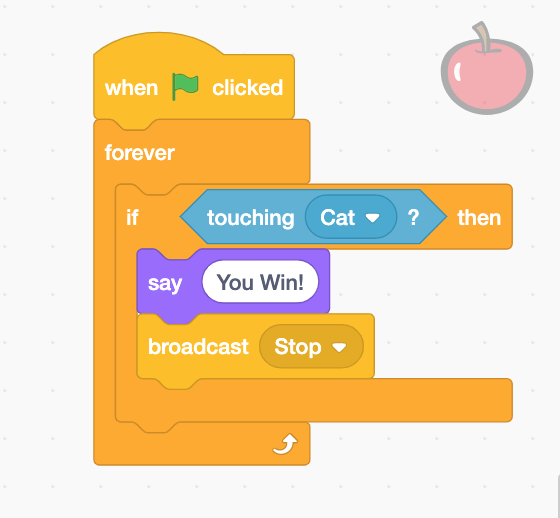
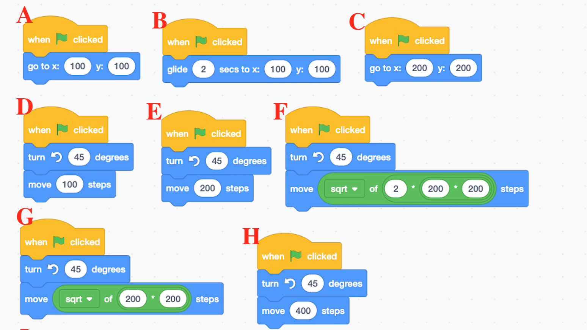
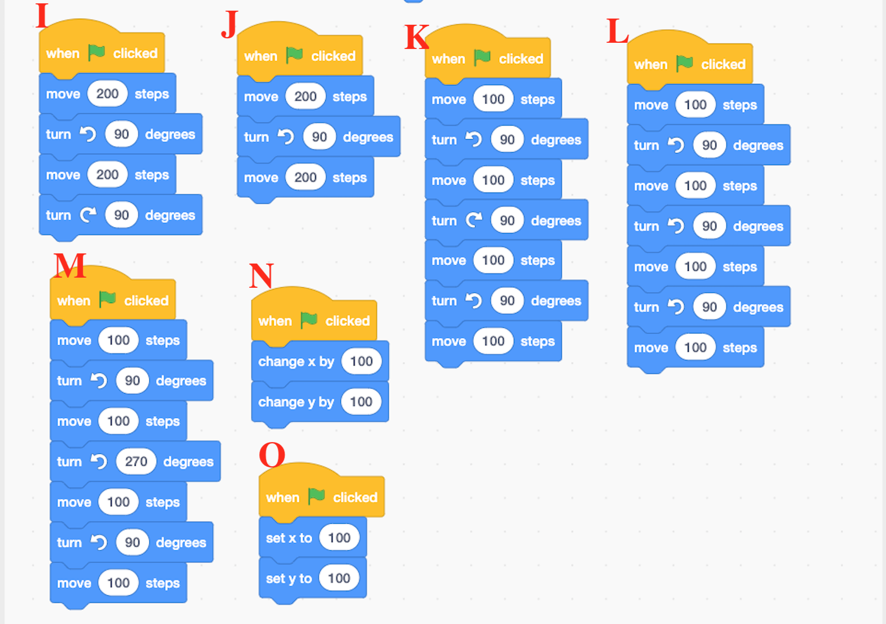
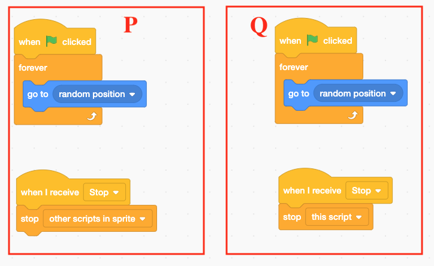
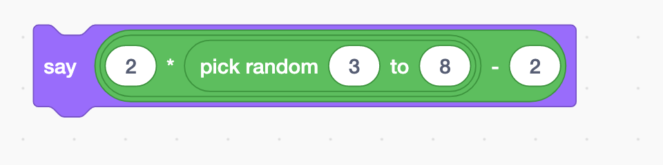
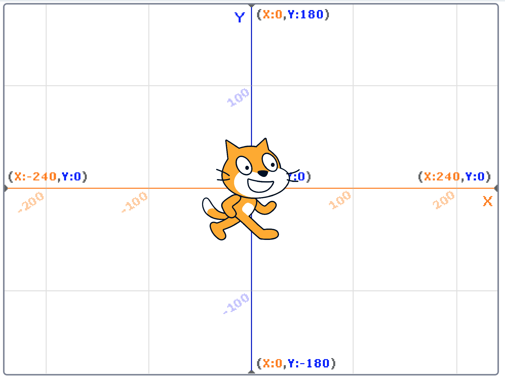
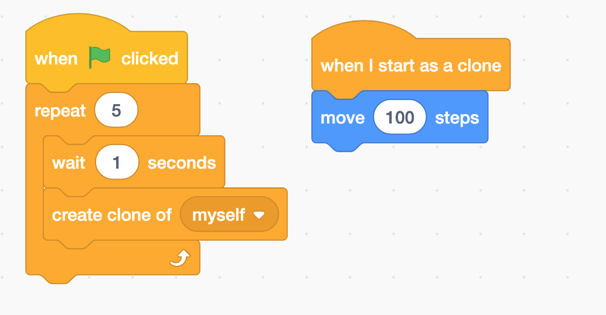
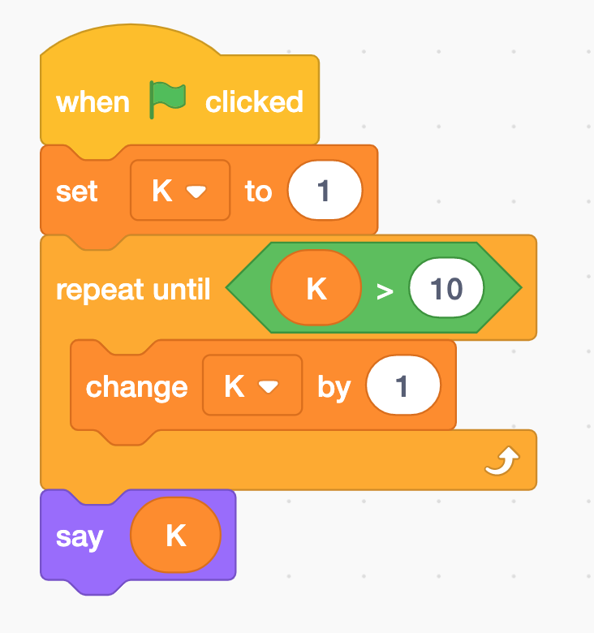
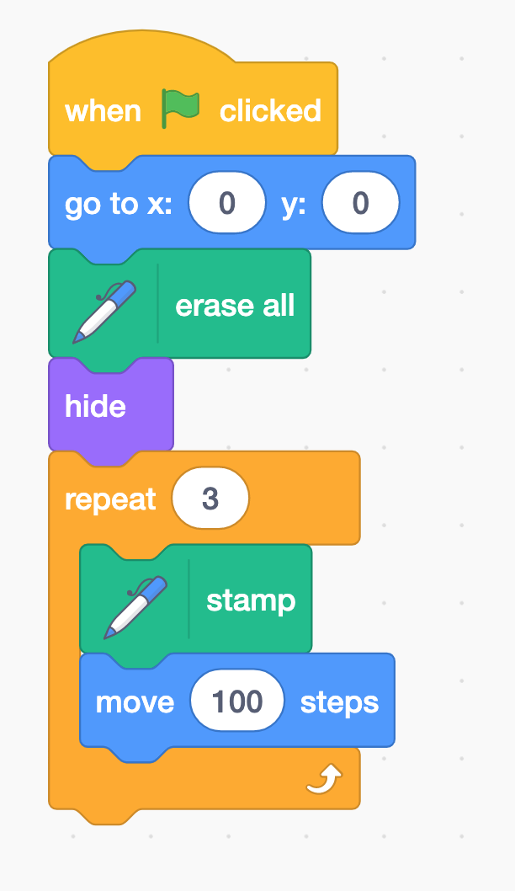

# Evaluate your Scratch Level

### 1   Which program can help Cat to touch the Apple? Your program should make the Apple say "You Win!".  Cat should stop moving after the Apple says "You Win!".  Please Select **ALL** correct answers. 

### 2. Which are the possible value of the following code? Please Select **ALL** correct answers. 

* A: 3
* B: 4
* C: 8
* D: 15

### 3. After running the following program, how many cats you can see?

### 4. What is the value of K after the program?

### 5. How many cats will be on the screen?

